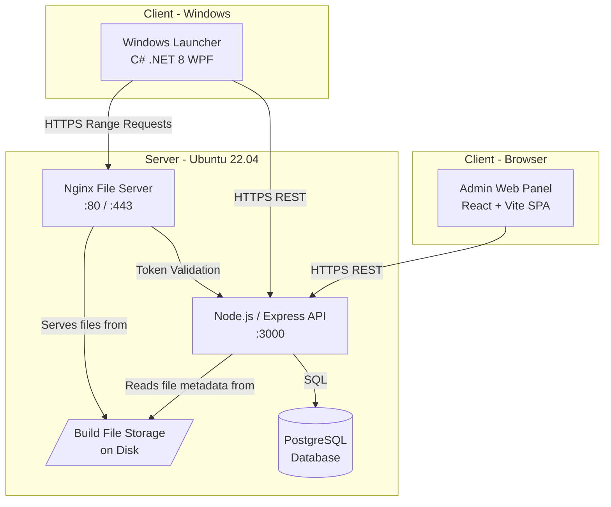
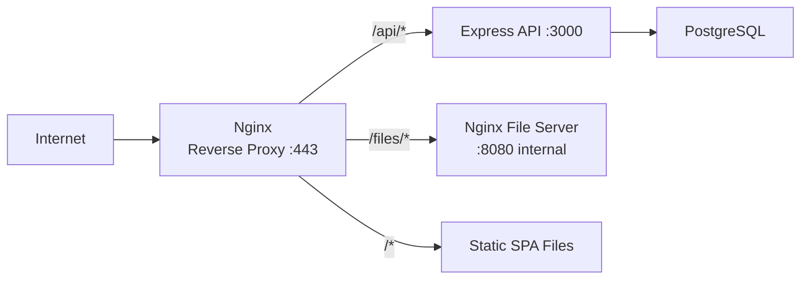

# Design Document: VIZZIO Deployment Platform

## Overview

VIZZIO is a Steam-style software distribution platform tailored for delivering large Unreal Engine builds to authorized users. The system is composed of two deployable products:

- **Admin Web Panel** — a React + Vite SPA for platform administration, backed by a Node.js/Express REST API and a PostgreSQL database.
- **Windows Launcher** — a C# .NET 8 WPF desktop application for discovering, downloading, installing, and opening deployments, with file delivery handled by Nginx over HTTP range requests.

Both products communicate with a single backend API. The entire system is designed to run on a single Ubuntu 22.04 LTS server and must be portable across AWS, DigitalOcean, Hetzner, and on-premise environments.

### Key Design Goals

- Secure, JWT-based authentication for both admin and end-user flows
- Per-user, per-deployment access control enforced exclusively on the API layer
- Resumable, parallel multi-stream file downloads with integrity verification
- Side-by-side version installation under a configurable install root
- Short-lived, scoped download tokens to prevent unauthorized file access
- Configurable branding with graceful fallbacks

---

## Architecture

### High-Level System Diagram



### Component Responsibilities

| Component | Technology | Responsibility |
|---|---|---|
| Admin Web Panel | React 18, Vite, TypeScript | Admin CRUD UI, served as static files |
| API | Node.js 20 LTS, Express 5, TypeScript | Business logic, auth, access control, token issuance |
| Database | PostgreSQL 16 | Persistent storage for all platform entities |
| File Server | Nginx | Static file serving with HTTP range request support |
| Windows Launcher | C# .NET 8, WPF | Deployment discovery, download management, installation |

### Deployment Topology

All server components run on a single Ubuntu 22.04 LTS host. The recommended deployment is via Docker Compose with four services: `api`, `postgres`, `nginx`, and an `nginx-static` serving the Admin SPA. The Nginx reverse proxy routes `/api/` to the Express process and `/files/` to the build file directories.



### Rate Limiting and Security Layer

IP-based rate limiting for admin login is enforced at the Express middleware layer using an in-process sliding-window counter stored in memory (or optionally Redis for multi-instance deployments). The middleware inspects `X-Forwarded-For` when behind a reverse proxy.

---

## Components and Interfaces

### API Endpoints

#### Admin Authentication (`/api/admin/auth`)

| Method | Path | Description |
|---|---|---|
| POST | `/api/admin/auth/login` | Admin login; returns JWT |

#### User Management (`/api/admin/users`)

| Method | Path | Description |
|---|---|---|
| GET | `/api/admin/users` | Paginated user list (page, pageSize=25) |
| POST | `/api/admin/users` | Create user |
| GET | `/api/admin/users/:id` | Get user detail + accessible deployments |
| PUT | `/api/admin/users/:id` | Edit username |
| POST | `/api/admin/users/:id/disable` | Disable user |
| POST | `/api/admin/users/:id/reset-password` | Reset user password |

#### Deployment Management (`/api/admin/deployments`)

| Method | Path | Description |
|---|---|---|
| GET | `/api/admin/deployments` | List all deployments with version counts |
| POST | `/api/admin/deployments` | Create deployment |
| GET | `/api/admin/deployments/:id` | Deployment detail + version list + authorized users |
| PUT | `/api/admin/deployments/:id` | Rename deployment |
| POST | `/api/admin/deployments/:id/versions` | Add version |
| PUT | `/api/admin/deployments/:id/versions/:vid` | Update version metadata (channel/status) |

#### Access Control (`/api/admin/access`)

| Method | Path | Description |
|---|---|---|
| POST | `/api/admin/access` | Grant user access to deployment |
| DELETE | `/api/admin/access` | Revoke user access to deployment |

#### Launcher API (`/api/launcher`)

| Method | Path | Description |
|---|---|---|
| POST | `/api/launcher/auth/login` | User login; returns JWT |
| GET | `/api/launcher/deployments` | List accessible deployments + versions |
| POST | `/api/launcher/download-token` | Issue download token for a version |
| POST | `/api/launcher/download-token/refresh` | Refresh an expiring download token |

#### File Server Token Validation (`/api/internal/token-validate`)

| Method | Path | Description |
|---|---|---|
| GET | `/api/internal/token-validate` | Nginx `auth_request` subrequest handler |

### Admin Web Panel Components

```
src/
  pages/
    LoginPage.tsx          — Admin login form
    UsersPage.tsx          — Paginated user list
    UserDetailPage.tsx     — User detail + deployments + password reset
    DeploymentsPage.tsx    — Deployment list
    DeploymentDetailPage.tsx — Versions + authorized users + access control
    SettingsPage.tsx       — (future)
  components/
    AuthGuard.tsx          — Route protection; redirects on expired JWT
    PaginatedTable.tsx     — Generic paginated data table
    VersionTable.tsx       — Versions grouped by channel + status
    AccessControlPanel.tsx — Grant/revoke access UI
  hooks/
    useAuth.ts             — JWT storage, expiry check, logout
    useApi.ts              — Axios instance with auth header injection
```

### Windows Launcher Components

```
VIZZIO.Launcher/
  ViewModels/
    LoginViewModel.cs          — Login form, 429 backoff timer
    DeploymentListViewModel.cs — Polling, deployment/version display
    DownloadViewModel.cs       — Parallel download orchestration
    SettingsViewModel.cs       — Install root config
  Services/
    AuthService.cs             — JWT storage in Windows Credential Manager
    ApiClient.cs               — HTTP client, JWT injection
    DownloadManager.cs         — Multi-stream download, resume, token refresh
    FileIntegrityService.cs    — SHA-256 checksum computation
    DiskSpaceService.cs        — Free space check before download
    InstallStateService.cs     — Track installed versions on disk
  Models/
    Deployment.cs
    DeploymentVersion.cs
    DownloadProgress.cs
    DownloadState.cs           — Persisted to disk for resume
  Views/
    LoginView.xaml
    DeploymentListView.xaml
    DownloadProgressView.xaml
    SettingsView.xaml
```

### Nginx File Server Configuration

The Nginx instance uses the `ngx_http_auth_request_module` to validate download tokens on every file request. The `auth_request` directive sends a subrequest to the API's internal token-validation endpoint. This is the sole enforcement point for download token security.

```nginx
location /files/ {
    auth_request /api/internal/token-validate;
    auth_request_set $auth_status $upstream_status;

    # Pass the Authorization header to the validation subrequest
    error_page 401 = @unauthorized;
    alias /srv/vizzio/builds/;
}

location = /api/internal/token-validate {
    internal;
    proxy_pass http://api:3000/api/internal/token-validate;
    proxy_pass_request_body off;
    proxy_set_header Content-Length "";
    proxy_set_header X-Original-URI $request_uri;
}
```

---

## Data Models

### Database Schema (PostgreSQL)

```sql
-- Admin accounts
CREATE TABLE admins (
    id          UUID PRIMARY KEY DEFAULT gen_random_uuid(),
    username    VARCHAR(50) NOT NULL UNIQUE,
    password_hash TEXT NOT NULL,          -- bcrypt, cost >= 12
    created_at  TIMESTAMPTZ NOT NULL DEFAULT now()
);

-- User accounts
CREATE TABLE users (
    id          UUID PRIMARY KEY DEFAULT gen_random_uuid(),
    username    VARCHAR(64) NOT NULL UNIQUE CHECK (username ~ '^[A-Za-z0-9_]{3,64}$'),
    password_hash TEXT NOT NULL,          -- bcrypt, cost >= 12
    is_enabled  BOOLEAN NOT NULL DEFAULT true,
    created_at  TIMESTAMPTZ NOT NULL DEFAULT now()
);

-- Deployments
CREATE TABLE deployments (
    id          UUID PRIMARY KEY DEFAULT gen_random_uuid(),
    name        VARCHAR(100) NOT NULL UNIQUE,
    created_at  TIMESTAMPTZ NOT NULL DEFAULT now()
);

-- Deployment versions
CREATE TABLE deployment_versions (
    id              UUID PRIMARY KEY DEFAULT gen_random_uuid(),
    deployment_id   UUID NOT NULL REFERENCES deployments(id) ON DELETE CASCADE,
    version_number  VARCHAR(50) NOT NULL,
    folder_path     TEXT NOT NULL,
    channel         VARCHAR(10) NOT NULL CHECK (channel IN ('stable', 'beta')),
    status          VARCHAR(10) NOT NULL CHECK (status IN ('released', 'archived')),
    created_at      TIMESTAMPTZ NOT NULL DEFAULT now(),
    UNIQUE (deployment_id, version_number)
);

-- Per-file SHA-256 checksums (populated when a version is added)
CREATE TABLE version_file_checksums (
    id              UUID PRIMARY KEY DEFAULT gen_random_uuid(),
    version_id      UUID NOT NULL REFERENCES deployment_versions(id) ON DELETE CASCADE,
    relative_path   TEXT NOT NULL,
    sha256          CHAR(64) NOT NULL,
    file_size_bytes BIGINT NOT NULL,
    UNIQUE (version_id, relative_path)
);

-- Access control: which users may access which deployments
CREATE TABLE user_deployment_access (
    user_id         UUID NOT NULL REFERENCES users(id) ON DELETE CASCADE,
    deployment_id   UUID NOT NULL REFERENCES deployments(id) ON DELETE CASCADE,
    granted_at      TIMESTAMPTZ NOT NULL DEFAULT now(),
    PRIMARY KEY (user_id, deployment_id)
);

-- IP-based login attempt tracking (for admin rate limiting)
CREATE TABLE admin_login_attempts (
    ip_address      INET NOT NULL,
    attempted_at    TIMESTAMPTZ NOT NULL DEFAULT now()
);
CREATE INDEX ON admin_login_attempts (ip_address, attempted_at);
```

### JWT Payload Schemas

**Admin JWT**
```json
{
  "sub": "<admin_id>",
  "role": "admin",
  "iat": 1700000000,
  "exp": 1700086400
}
```

**User JWT (Launcher)**
```json
{
  "sub": "<user_id>",
  "role": "user",
  "iat": 1700000000,
  "exp": 1700086400
}
```

**Download Token JWT**
```json
{
  "sub": "<user_id>",
  "version_id": "<version_id>",
  "type": "download",
  "iat": 1700000000,
  "exp": 1700003600
}
```

### Launcher Persistence Models

**Download State File** (JSON, written to `<InstallRoot>/.vizzio/downloads/<version_id>.json`)
```json
{
  "version_id": "uuid",
  "deployment_name": "MyGame",
  "version_number": "1.2.0",
  "install_path": "C:\\Games\\MyGame\\1.2.0",
  "total_bytes": 10737418240,
  "files": [
    {
      "relative_path": "MyGame/Binaries/Win64/MyGame.exe",
      "file_size_bytes": 104857600,
      "sha256": "abc123...",
      "bytes_downloaded": 52428800,
      "verified": false
    }
  ],
  "status": "paused",
  "created_at": "2024-01-01T00:00:00Z"
}
```

**Launcher Configuration File** (`appsettings.json` alongside the executable)
```json
{
  "ApiBaseUrl": "https://vizzio.example.com/api",
  "FileServerBaseUrl": "https://vizzio.example.com/files",
  "LogoAssetPath": "",
  "DefaultInstallRoot": "C:\\Games"
}
```

**Install Root Setting** — persisted in Windows user-scoped application settings (`Properties.Settings`) and also stored in the download state for cross-device consistency.

---

## Correctness Properties

*A property is a characteristic or behavior that should hold true across all valid executions of a system — essentially, a formal statement about what the system should do. Properties serve as the bridge between human-readable specifications and machine-verifiable correctness guarantees.*

**Property Reflection Notes:**
- 4.6 and 7.3 are the same archived-version-exclusion property — consolidated into Property 7.
- 5.5 and 7.1 both test access-filtered deployment list — consolidated into Property 10.
- 9.3 and 13.3 both test checksum retry/abort logic — consolidated into Property 18.
- 15.1 and 8.3 both test file server token rejection — consolidated into Property 22.
- 8.12 and 13.4 both test size formatting in error messages — consolidated into Property 16.
- 5.3 (revoke removes permission) is the inverse of 5.1 (grant records permission) — combined into a single round-trip Property 11.
- 3.4/3.5/3.6 are all variants of deployment name uniqueness — consolidated with 3.1/3.2 properties.

---

### Property 1: Admin JWT lifetime is exactly 24 hours

*For any* successful admin login, the issued JWT's `exp` claim minus its `iat` claim SHALL equal exactly 86400 seconds.

**Validates: Requirements 1.2**

---

### Property 2: Invalid admin credentials never distinguish username vs password

*For any* pair of credentials that fails admin authentication, the API response body SHALL NOT contain information that differentiates between an incorrect username and an incorrect password, and SHALL return HTTP 401.

**Validates: Requirements 1.3**

---

### Property 3: All stored passwords use bcrypt with cost factor >= 12

*For any* admin or user password stored in the database, the password hash SHALL be a bcrypt hash with a cost factor of at least 12 (hash prefix `$2b$12$` or higher).

**Validates: Requirements 1.4, 2.6**

---

### Property 4: Admin IP rate limiting blocks after 10 failures in 15 minutes

*For any* IP address that has submitted more than 10 failed login attempts within a 15-minute sliding window, all subsequent login requests from that IP SHALL return HTTP 429 until the window expires.

**Validates: Requirements 1.6**

---

### Property 5: Username validation enforces alphanumeric + underscore, 3-64 characters

*For any* string submitted as a username during user creation or edit, the API SHALL accept it if and only if it matches the pattern `^[A-Za-z0-9_]{3,64}$` AND is not already in use by another account; any string violating either constraint SHALL be rejected with an appropriate error response.

**Validates: Requirements 2.1, 2.2**

---

### Property 6: Disabled user accounts are rejected at authentication

*For any* user account whose `is_enabled` flag is false, any authentication attempt SHALL be rejected with an error response indicating the account is inactive, regardless of whether the supplied credentials are correct.

**Validates: Requirements 2.4**

---

### Property 7: Passwords shorter than 8 characters are always rejected

*For any* password string of length less than 8 characters submitted to the API for user creation or password reset, the API SHALL return an error response and the account SHALL NOT be created or modified.

**Validates: Requirements 2.7**

---

### Property 8: Duplicate usernames return HTTP 409

*For any* username that is already in use by an existing account, any attempt to create a new account or edit an existing account to that username SHALL return HTTP 409.

**Validates: Requirements 2.8**

---

### Property 9: User list pagination returns correct pages of exactly 25 records

*For any* set of N users, the paginated list endpoint SHALL return ⌈N/25⌉ pages where each page except the last contains exactly 25 records, and the last page contains N mod 25 (or 25 if N is a multiple of 25) records.

**Validates: Requirements 2.9**

---

### Property 10: Deployment names are unique and enforce 1-100 character length

*For any* string submitted as a deployment name, the API SHALL accept it if and only if its length is between 1 and 100 characters inclusive AND no other deployment currently has that name; violation of either constraint SHALL return HTTP 409 or a validation error as appropriate.

**Validates: Requirements 3.1, 3.2, 3.4, 3.5, 3.6**

---

### Property 11: Deployment list response includes correct version count for each deployment

*For any* deployment with N associated versions, the deployment list endpoint SHALL return that deployment's record with a version count equal to N.

**Validates: Requirements 3.3**

---

### Property 12: Version addition validates folder path existence

*For any* folder path submitted when adding a version, the API SHALL only record the version if the path exists on the server file system; if the path does not exist, the API SHALL return HTTP 422 and no version record SHALL be created.

**Validates: Requirements 4.2, 4.3**

---

### Property 13: Version channel and status round-trip correctly

*For any* version, setting its channel to `stable` or `beta` and its status to `released` or `archived` SHALL persist those values such that a subsequent read of that version returns the same channel and status values.

**Validates: Requirements 4.4, 4.5**

---

### Property 14: Archived versions never appear in the Launcher deployment list

*For any* version whose status is `archived`, the Launcher deployment list endpoint SHALL not include that version in its response, regardless of the requesting user's access permissions.

**Validates: Requirements 4.6, 7.3**

---

### Property 15: Released versions appear for authorized users; grouped by channel

*For any* released version of a deployment, the Launcher deployment list endpoint SHALL include that version in the response for any user who has been granted access to the parent deployment, and the response SHALL group versions by channel (`stable` / `beta`).

**Validates: Requirements 4.7, 4.8, 7.2**

---

### Property 16: Access control filters deployment list to exactly the user's granted deployments

*For any* user U with a specific set of granted deployments D, the Launcher deployment list endpoint authenticated as U SHALL return exactly the deployments in D — no more, no fewer — and each deployment SHALL include only its released versions.

**Validates: Requirements 5.5, 7.1**

---

### Property 17: Access grant and revoke are consistent inverses

*For any* (user, deployment) pair: after granting access, the user SHALL appear in the deployment's access list and the deployment SHALL appear in the user's access list; after subsequently revoking that access, neither association SHALL remain. A duplicate grant SHALL return HTTP 409. A revoke where no access exists SHALL return HTTP 404.

**Validates: Requirements 5.1, 5.2, 5.3, 5.4, 5.7, 5.8**

---

### Property 18: Expired JWTs are discarded and login screen shown

*For any* JWT in the Windows Credential Manager whose `exp` claim is in the past at Launcher startup, the Launcher SHALL delete the token from the Credential Store and present the login screen rather than proceeding to the deployment list.

**Validates: Requirements 6.6**

---

### Property 19: Sign-out always clears Credential Store

*For any* authenticated Launcher session, activating the sign-out action SHALL remove the JWT from the Windows Credential Manager Credential Store entry.

**Validates: Requirements 6.8**

---

### Property 20: 429 response disables login submit for the Retry-After duration

*For any* HTTP 429 response received on a login attempt, the Launcher SHALL disable the submit button for the number of seconds specified in the `Retry-After` header, defaulting to 60 seconds when the header is absent.

**Validates: Requirements 6.10**

---

### Property 21: Users with no accessible deployments see an empty-state message

*For any* authenticated user who has been granted access to zero deployments, the Launcher deployment list view SHALL display a message indicating no deployments are currently available.

**Validates: Requirements 7.8**

---

### Property 22: Download token is a scoped JWT with lifetime <= 1 hour

*For any* download token issued by the API, the token SHALL be a signed JWT with `exp - iat <= 3600` seconds, SHALL contain the issuing user's ID and the requested version ID, and SHALL be signed with a server-side secret not exposed to clients.

**Validates: Requirements 8.2, 15.2, 15.3**

---

### Property 23: File server rejects all requests with missing or invalid download tokens

*For any* HTTP request to the file server that includes a missing, malformed, expired, or mis-scoped download token, the file server SHALL return HTTP 401 and SHALL NOT serve any file data.

**Validates: Requirements 8.3, 15.1, 15.5**

---

### Property 24: Download token is rejected when presented for a different user or version

*For any* download token issued to user U for version V, presenting that token for a different user U′ or a different version V′ SHALL result in the API returning HTTP 403.

**Validates: Requirements 15.4**

---

### Property 25: Download uses between 4 and 16 parallel HTTP range-request streams

*For any* version download initiated by the Launcher, the number of concurrent HTTP range-request streams SHALL be between 4 and 16 inclusive.

**Validates: Requirements 8.4, 8.5**

---

### Property 26: Interrupted downloads resume from the last successfully received byte

*For any* download interrupted at byte offset B of a file, resuming the download SHALL issue an HTTP range request starting at byte B and SHALL NOT re-download bytes 0 through B−1.

**Validates: Requirements 8.6**

---

### Property 27: Download progress state is persisted to disk

*For any* in-progress download, the Launcher SHALL write a state file to disk containing the current byte offset for each file such that a fresh Launcher start can restore the in-progress state.

**Validates: Requirements 8.7**

---

### Property 28: Cancelled download removes all partial files

*For any* download that is cancelled, all partially downloaded files for that version SHALL be deleted from the install directory, leaving no remnant files.

**Validates: Requirements 8.9**

---

### Property 29: Download statistics refresh at intervals of no more than 2 seconds

*For any* active download, the displayed download speed in MB/s, remaining data size, and estimated time remaining SHALL each be updated at intervals not exceeding 2 seconds.

**Validates: Requirements 8.10**

---

### Property 30: Download is blocked when insufficient disk space is available

*For any* version download where the version's total file size exceeds the available free space in the Install Root, the Launcher SHALL NOT begin any file transfers and SHALL display a message showing both the required and available sizes formatted as: MB (if < 1 GB) or GB with exactly two decimal places (if >= 1 GB).

**Validates: Requirements 8.11, 8.12, 13.4**

---

### Property 31: Download token is refreshed before expiry when age reaches 55 minutes

*For any* active download whose current download token was issued more than 55 minutes ago, the Launcher SHALL request a refreshed token from the API before the 60-minute expiry is reached and replace the in-use token with the new one.

**Validates: Requirements 8.13**

---

### Property 32: Mid-download disk space shortfall pauses the download

*For any* active download where the available free space on the Install Root falls below the remaining bytes to download, the Launcher SHALL pause the download and display a message stating the size shortfall.

**Validates: Requirements 8.14**

---

### Property 33: All files in a version have SHA-256 checksums stored at version creation

*For any* version added to the platform whose folder contains N files, the API SHALL compute and store a SHA-256 checksum for each of those N files, resulting in exactly N checksum records associated with that version.

**Validates: Requirements 9.1**

---

### Property 34: Downloaded file checksum matches stored value; repeated failure aborts download

*For any* downloaded file F with a stored checksum C: if the computed SHA-256 of F equals C, the file is accepted; if the checksums do not match, the file is deleted and a retry is offered; if the checksum fails 3 consecutive times for the same file, the download of that file is aborted and the user is advised to contact support.

**Validates: Requirements 9.2, 9.3, 13.3**

---

### Property 35: Version marked as Installed when all files pass checksum verification

*For any* version V, the Launcher SHALL set V's installation state to Installed if and only if all files in V have been downloaded and their SHA-256 checksums have been verified against the stored values.

**Validates: Requirements 9.4, 9.5**

---

### Property 36: Each version is installed in a unique subdirectory path

*For any* version V of deployment D installed under Install Root R, the installation path SHALL be `R/<D>/<V>/` where `<D>` is the deployment name and `<V>` is the version number, and this directory SHALL be distinct from all other installed versions.

**Validates: Requirements 10.1, 10.2**

---

### Property 37: Already-installed version blocks a new download attempt

*For any* version that is fully installed (Installed state), initiating a download SHALL display a message indicating the version is already installed and SHALL NOT start a new download.

**Validates: Requirements 10.3**

---

### Property 38: Installation state accurately reflects file presence

*For any* version V, the Launcher SHALL report V as Installed if and only if V's install subdirectory exists and all files listed in V's manifest are present at their expected paths under that directory.

**Validates: Requirements 10.4**

---

### Property 39: Uninstall removes exactly the target version's subdirectory

*For any* uninstall operation on version V of deployment D, the Launcher SHALL delete only the subdirectory `<InstallRoot>/<D>/<V>/` and SHALL leave all sibling version directories of D intact.

**Validates: Requirements 10.5**

---

### Property 40: Install Root change applies to subsequent downloads; does not move existing installs

*For any* Install Root path change from R1 to R2, all downloads initiated after the change SHALL use R2 as the base directory, and all previously installed versions under R1 SHALL remain at their original paths.

**Validates: Requirements 11.2**

---

### Property 41: Install Root setting persists across application restarts

*For any* valid Install Root path R configured by the user, R SHALL be restored as the active Install Root when the Launcher is restarted.

**Validates: Requirements 11.3**

---

### Property 42: Non-writable and invalid Install Root paths are rejected

*For any* path P submitted as the Install Root, if P is not writable by the Launcher process, or if P contains invalid path characters, or if P exceeds 260 characters, the Launcher SHALL display an appropriate error message and SHALL NOT apply P as the new Install Root.

**Validates: Requirements 11.6, 11.7**

---

### Property 43: Open Folder button visibility matches installation state

*For any* version V, the Launcher SHALL display an "Open Folder" button for V if and only if V is in the Installed state (all expected files present in the install subdirectory).

**Validates: Requirements 12.1**

---

### Property 44: Network errors trigger retry/pause, auto-pause after 3 consecutive failures

*For any* download experiencing N consecutive network errors: if N < 3, the user SHALL be offered the option to retry or pause; if N >= 3, the download SHALL be automatically paused and a message SHALL advise the user to check their connection.

**Validates: Requirements 13.1**

---

### Property 45: HTTP 5xx responses display a generic server unavailability message

*For any* HTTP 5xx response received by the Launcher from the API, the user-facing message SHALL state that the server is temporarily unavailable without including the raw status code.

**Validates: Requirements 13.2**

---

### Property 46: No error message contains raw HTTP codes, stack traces, or internal identifiers

*For any* error condition encountered by the Launcher, the text displayed to the user SHALL NOT contain raw HTTP status codes, exception stack traces, or internal system identifiers.

**Validates: Requirements 13.5**

---

### Property 47: Custom logo displayed when path is valid; default logo shown otherwise

*For any* logo asset path configured in the application settings: if the file exists, is readable, and is PNG/JPEG/ICO format with size <= 5 MB, the Launcher SHALL display that image; otherwise, the Launcher SHALL display the default logo without showing an error to the user.

**Validates: Requirements 14.3, 14.4**

---

### Property 47a: Client branding is package-time configurable

*For any* client-branded Launcher distribution, the installer or ZIP packaging process SHALL be able to place a client logo and `launcher-branding.json` beside the same Launcher executable without changing or rebuilding application code.

**Validates: Requirements 14.5, 14.6**

---

### Property 48: Launcher configuration is preserved across installer upgrades

*For any* existing Launcher installation with a configured Install Root path and a persisted JWT, running a newer version of the installer SHALL preserve both the Install Root path and the persisted JWT without requiring the user to reconfigure the application.

**Validates: Requirements 16.4**

---

## Error Handling

### API Error Response Contract

All API errors follow a consistent JSON envelope:

```json
{
  "error": {
    "code": "USERNAME_TAKEN",
    "message": "The username is already in use by another account."
  }
}
```

Standard HTTP status codes used:
- `400` — Validation error (malformed request, missing required fields)
- `401` — Authentication failure (bad credentials, expired/missing JWT)
- `403` — Authorization failure (disabled account, token mis-scoped)
- `404` — Resource not found (revoke of non-existent access, missing deployment)
- `409` — Conflict (duplicate username, duplicate deployment name, duplicate access grant)
- `422` — Unprocessable entity (folder path does not exist)
- `429` — Rate limited (admin IP blocked for 15 minutes)
- `5xx` — Server errors (never expose internals in response body)

### Admin Web Panel Error Handling

- All API errors are caught by a centralized Axios response interceptor.
- HTTP 401 with an expired JWT clears the token from local storage and redirects to `/login`.
- Form validation errors (empty fields, constraint violations) are displayed inline next to the affected field.
- Conflict errors (409) and not-found errors (404) are shown as non-blocking toast notifications.
- Network errors (request never reached the server) show a generic connectivity message.

### Windows Launcher Error Handling

| Scenario | User-Visible Behavior |
|---|---|
| Login: invalid credentials (401) | "The username or password is incorrect." |
| Login: account disabled (403) | "Your account has been disabled. Please contact your administrator." |
| Login: rate limited (429) | Submit button disabled for `Retry-After` seconds; countdown displayed |
| Login: credential store write failure | "Your session could not be saved. Please try again." |
| Download: network error (< 3 retries) | Descriptive message + Retry / Pause buttons |
| Download: network error (3 consecutive) | Auto-pause + "Please check your connection." |
| Download: 5xx from API | "The server is temporarily unavailable. Please try again later." |
| Download: checksum mismatch (< 3) | "File [name] failed integrity check. Retry?" |
| Download: checksum mismatch (3rd) | Abort + "Please contact support." |
| Download: insufficient disk space | Required: X MB/GB, Available: Y MB/GB |
| Download: mid-download disk full | Pause + size shortfall message |
| Open Folder: directory missing | "The installation folder could not be found." |
| Install Root: non-writable | "The selected path is not writable." |
| Install Root: invalid path | "The path contains invalid characters or exceeds the 260-character limit." |
| Token refresh: auth service down | Pause download + "Could not refresh download authorization. Please try again." |
| File not found in Credential Store | Treat as no JWT; show login screen |

### Error Display Rules

1. No raw HTTP status codes in any user-facing string.
2. No stack traces, exception class names, or internal IDs in any user-facing string.
3. All error strings are in plain language, actionable where possible.
4. Errors that do not require user action (e.g., non-fatal logo load failure) are silently handled with a log entry.

### Nginx / File Server Error Handling

- Token validation subrequest failure → 401 returned to client.
- Token validation service unavailable → fail-closed (deny request, return 401 or 503).
- Nginx internal errors → standard 5xx response; no internal details exposed.

---

## Testing Strategy

### Overview

The testing strategy uses a dual-approach model:

1. **Property-based tests (PBT)** — verify universal properties across many generated inputs; these map directly to the numbered Correctness Properties above.
2. **Unit / example-based tests** — verify specific scenarios, edge cases, and error conditions.
3. **Integration tests** — verify end-to-end behavior across components, timing requirements, and external service interactions.
4. **Smoke tests** — verify build artifacts, configuration, and installation.

### Property-Based Testing

**Library choices:**
- API (Node.js/TypeScript): [`fast-check`](https://github.com/dubzzz/fast-check)
- Windows Launcher (C#/.NET 8): [`FsCheck`](https://fscheck.github.io/FsCheck/) or [`CsCheck`](https://github.com/AnthonyLloyd/CsCheck)

**Configuration:**
- Minimum **100 iterations** per property test (fast-check default `numRuns: 100`).
- Each property test is tagged with a comment referencing its design property.
- Tag format: `// Feature: vizzio-deployment-platform, Property N: <property_text>`

**Scope — Properties covered by PBT:**

Properties 1–4 (auth), 5–11 (user/deployment management), 12–15 (version management), 16–17 (access control), 18–21 (launcher auth/discovery), 22–25 (download tokens), 26–32 (download management), 33–35 (file integrity), 36–43 (installation/settings), 44–48 (error handling/branding).

Each property is implemented as a single PBT test. Properties that involve UI state (e.g., button visibility, message display) are tested against the relevant ViewModel or service layer, not against rendered UI.

### Unit / Example-Based Tests

Unit tests cover:
- Admin login form field rendering and empty-field validation (Req 1.1, 1.7)
- JWT expiry redirect behavior (Req 1.5)
- User disable / password reset operations (Req 2.3, 2.5)
- Version addition required-field validation (Req 4.1)
- Launcher login screen shown when no JWT present (Req 6.1)
- Credential Manager write failure handling (Req 6.3)
- Session restoration when valid JWT present (Req 6.5)
- Open Folder action — successful case (Req 12.2)
- Logo display on each screen (Req 14.1, 14.2)
- Shortcuts created by installer (Req 16.2)

### Integration Tests

Integration tests cover:
- Access revocation reflected within 5 seconds (Req 5.6)
- Archived version removed from Launcher display on next API refresh (Req 7.4)
- Polling interval of 5 minutes fires correctly (Req 7.5)
- End-to-end download flow: token issuance → Nginx auth_request → file served
- Token validation service unavailability: file server denies all requests (Req 15.6)
- Manual refresh control triggers API call (Req 7.6)

### Smoke Tests

- Launcher installer produces NSIS/Inno Setup artifact (Req 16.1)
- Installer installs on a clean machine without internet (Req 16.3)
- Download token secret not present in any API response (Req 15.2)
- Admin login rate limiter counter resets after 15-minute window

### Test Organization

```
tests/
  api/
    unit/
      auth/              # JWT issuance, bcrypt hashing, rate limiting
      users/             # Username validation, pagination
      deployments/       # Name uniqueness, version management
      access/            # Grant/revoke logic
      download-tokens/   # Token issuance, scoping, lifetime
    integration/
      access-revocation/ # 5-second revocation propagation
      file-server/       # End-to-end download token + Nginx auth
  launcher/
    unit/
      AuthService/       # Credential Manager persistence, JWT expiry
      DownloadManager/   # Resume, parallel streams, token refresh
      FileIntegrity/     # SHA-256 verification, retry/abort
      DiskSpace/         # Size formatting, space checks
      InstallState/      # Path computation, state tracking
    property/
      AuthService.PBT/
      DownloadManager.PBT/
      VersionInstall.PBT/
      Settings.PBT/
    integration/
      EndToEndDownload/
  smoke/
    installer-artifact/
    clean-install/
```

### Coverage Goals

- All 48 correctness properties have a corresponding PBT test.
- All acceptance criteria marked EXAMPLE have a corresponding unit test.
- All acceptance criteria marked INTEGRATION have a corresponding integration test.
- All acceptance criteria marked SMOKE have a corresponding smoke test.
- Edge cases (EDGE_CASE classification) are covered by PBT generators that include boundary values and are not written as separate standalone tests.
