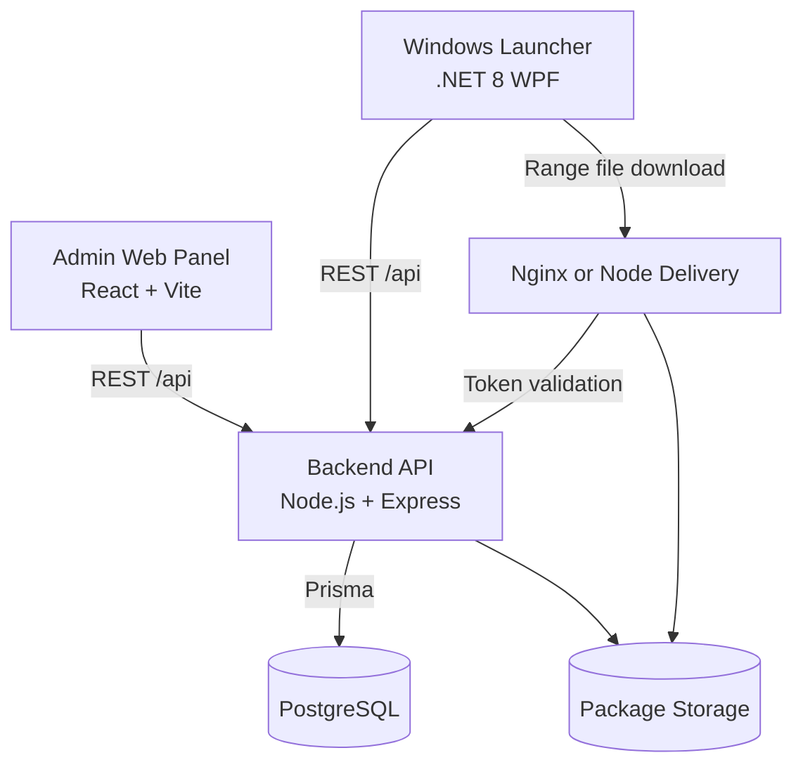
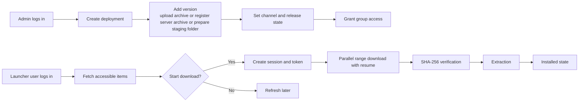
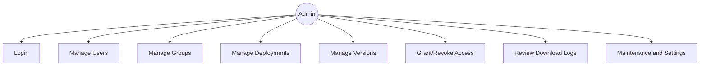
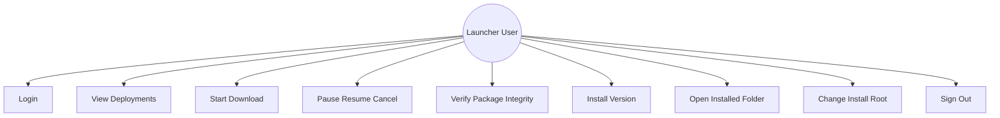
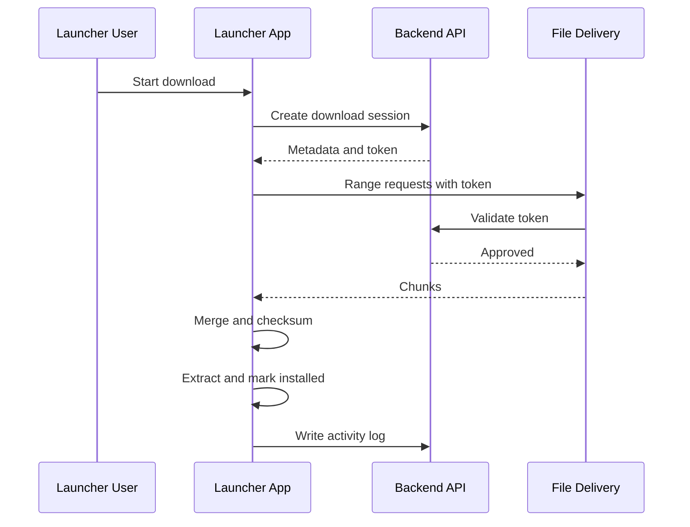

# VIZZIO Diagrams

This document centralizes project diagrams for architecture and flow reviews.

## 1. System Architecture

## 2. End-to-End User Flow

## 3. Admin Use Cases

## 4. Launcher User Use Cases

## 5. Download Pipeline Sequence

